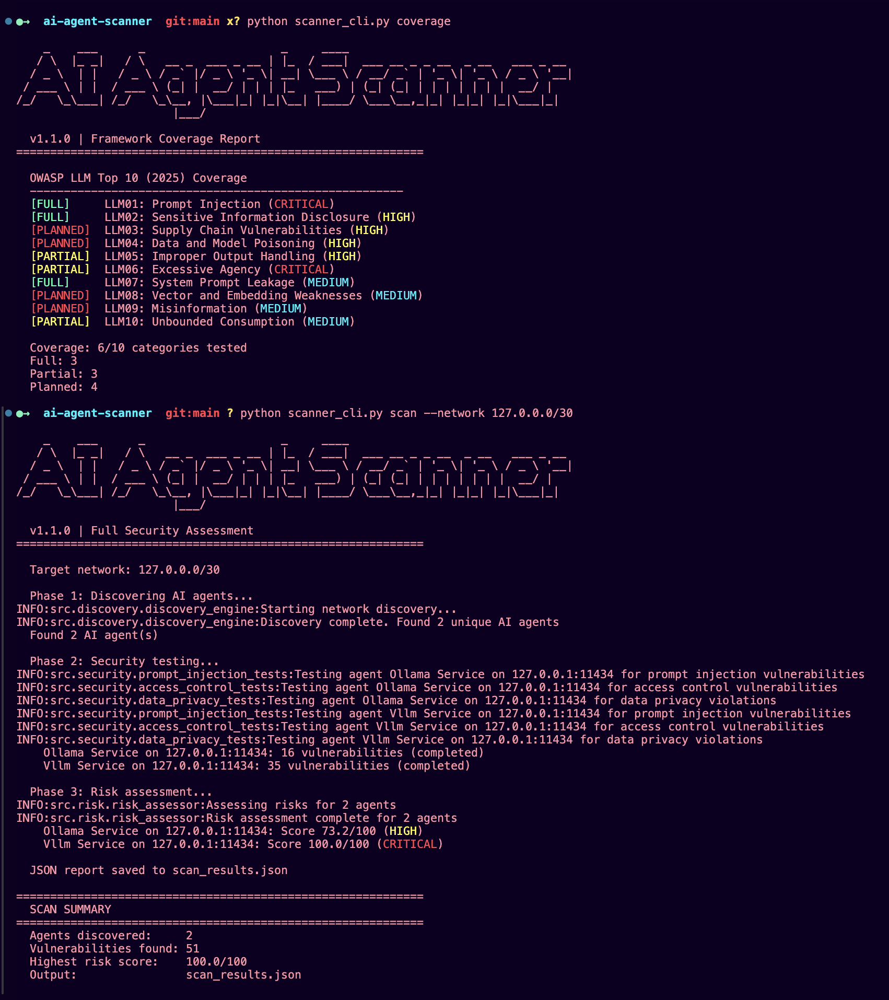

# AI Agent Scanner

**Find the AI you don't know about. Secure the AI you do.**

Asset inventory and security assessment for AI agents — the first open-source tool that discovers shadow AI across your infrastructure, tests it for vulnerabilities, and maps findings to compliance frameworks.



## The Problem

Security teams are securing AI systems they know about.

They are not securing the ones they don't.

Most organizations have more AI agents in production than their security team can account for. Developers integrate AI APIs in minutes. Cloud providers ship one-click model deployments. No one files a ticket.

Most teams underestimate how much AI is already running in their environment. Until they scan.

This tool finds them.

## Quick Start (1-minute scan)

```bash
git clone https://github.com/perfecxion-ai/ai-agent-scanner.git
cd ai-agent-scanner
pip install -r requirements.txt

# Scan your network for AI agents
python scanner_cli.py discover --network 192.168.1.0/24

# Full scan with risk scoring
python scanner_cli.py scan --network 192.168.1.0/24 --output results.json

# See what's covered
python scanner_cli.py coverage
```

**Have Ollama running locally?** Try this right now:

```bash
python scanner_cli.py scan --network 127.0.0.0/30 --output local_scan.json
```

It will find your Ollama instance, test it for vulnerabilities, and show you the risk score. Takes about 2 minutes.

## What Makes This Different

Most AI security tools assume you already know what to test.

This one doesn't.

It answers the first question security teams actually have:

**What AI is running in my environment right now?**

This is asset inventory for AI.

Then it tests what it finds and tells you what it means for the business:

```
Discovery (find it) --> Security Testing (break it) --> Risk Scoring (prioritize it)
```

No other tool — not Garak, Giskard, PyRIT, or Lakera — does discovery. They all start from a known endpoint. This starts from "what's out there?"

## Who This Is For

- **Security teams** — discover shadow AI and assess risk
- **AppSec leads** — integrate AI security checks into CI/CD (SARIF output included)
- **Platform engineers** — scan deployments before they become exposures
- **Compliance** — map AI risk to GDPR, SOC 2, HIPAA, NIST AI RMF, EU AI Act
- **Researchers** — extend attack coverage and contribute detection modules

## Discovery Coverage

The scanner finds AI agents across four surfaces:

- **Network** — exposed AI endpoints (OpenAI-compatible APIs, Ollama, custom)
- **Code** — SDK usage, API keys, endpoint configs in repositories
- **Traffic** — AI API calls in logs and HAR files
- **Cloud** — managed AI services (SageMaker, Bedrock, Azure OpenAI, Vertex AI)

Cloud scanning requires optional SDKs: `pip install ai-agent-scanner[cloud]`

Each method catches what the others miss.

## Example Output

```
  Phase 1: Discovering AI agents...
  Found 4 AI agent(s)

  Phase 2: Security testing...
    Internal Chatbot:     3 vulnerabilities (completed)
    Customer Support Bot: 5 vulnerabilities (completed)

  Phase 3: Risk assessment...
    Internal Chatbot:     Score 42.0/100 (MEDIUM)
    Customer Support Bot: Score 78.5/100 (HIGH)

  ============================================================
  SCAN SUMMARY
  ============================================================
  Agents discovered:     4
  Vulnerabilities found: 8
  Highest risk score:    78.5/100
  Output:                results.json
```

```json
{
  "agents_discovered": 4,
  "total_vulnerabilities": 8,
  "risk_assessments": [{
    "agent_name": "Customer Support Bot",
    "overall_risk_score": 78.5,
    "risk_level": "high",
    "critical_findings": ["No authentication", "PII disclosure"],
    "compliance_implications": ["GDPR Article 32", "SOC 2 CC6.1"]
  }]
}
```

## Coverage (Honest View)

**Tested:**
- Direct prompt injection (70+ payloads across 7 categories)
- Auth bypass (15+ techniques), weak credentials, API key security
- PII disclosure (7 data types), cross-tenant leakage, session security
- Rate limiting, error info disclosure, privacy compliance

**Not yet covered:**
- Indirect prompt injection (highest real-world attack vector in 2025)
- MCP server security / agentic workflow attacks
- RAG poisoning and retrieval manipulation
- Multi-modal injection (image/PDF-based)
- Model extraction and adversarial suffixes

Run `python scanner_cli.py coverage` for the live OWASP LLM Top 10 matrix:

```
[FULL]     LLM01: Prompt Injection     (direct only — indirect planned)
[FULL]     LLM02: Sensitive Info Disclosure
[PLANNED]  LLM03: Supply Chain
[PLANNED]  LLM04: Data/Model Poisoning
[PARTIAL]  LLM05: Improper Output Handling
[PARTIAL]  LLM06: Excessive Agency
[FULL]     LLM07: System Prompt Leakage
[PLANNED]  LLM08: Vector/Embedding Weaknesses
[PLANNED]  LLM09: Misinformation
[PARTIAL]  LLM10: Unbounded Consumption
```

6/10 categories actively tested. 4 planned.

## Risk Scoring

Findings are scored using a CVSS-inspired model:

- **Severity** — vulnerability type + confidence weighting
- **Exposure** — internet-facing (1.5x), production (1.3x), public API (1.4x)
- **Business impact** — PII access (1.3x), financial data (1.4x), healthcare (1.5x)

Every finding is mapped to:
- **OWASP LLM Top 10 (2025)** and **MITRE ATLAS**
- **GDPR**, **SOC 2**, **HIPAA**, **PCI DSS**, **NIST AI RMF**, **EU AI Act**

## Output Formats

- **JSON** — structured report with full vulnerability details and framework mappings
- **SARIF** — v2.1.0 for GitHub Code Scanning and Azure DevOps
- **Executive summary** — text format for quick review

```bash
# SARIF for CI/CD
python scanner_cli.py scan --network 10.0.0.0/24 --format sarif --output results.sarif
```

## Architecture

```
CLI / Web API / REST
    |
Discovery Engine (Network + Code + Cloud + Traffic)
    |
Security Testing (Prompt Injection + Access Control + Privacy)
    |
Risk Assessment + Compliance (OWASP + ATLAS + 6 frameworks)
    |
Reporting (JSON + SARIF + Executive Summary)
```

## Installation

```bash
# Standard
pip install -r requirements.txt

# With cloud scanning (AWS, Azure, GCP)
pip install -r requirements.txt boto3 azure-identity azure-mgmt-cognitiveservices google-cloud-aiplatform

# Development
pip install -e ".[dev]"
```

**Requirements:** Python 3.10+

## Responsible Use

This tool is for defensive security only. Scan systems you own or have explicit written permission to test.

Tested across lab environments and authorized enterprise assessments. Built-in safeguards: rate limiting, payload caps, host limits, request timeouts, non-destructive testing only.

## Contributing

PRs welcome. Add tests for new functionality. Run `pytest tests/ -v` before submitting.

## License

[GNU General Public License v3.0](LICENSE) | Copyright (c) 2025 Scott C Thornton

---

**Built by [perfecXion.ai](https://perfecxion.ai)** | The AI agents are already running in your infrastructure. The only question is whether you know where they are.
